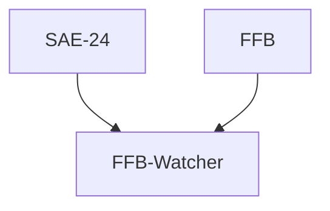
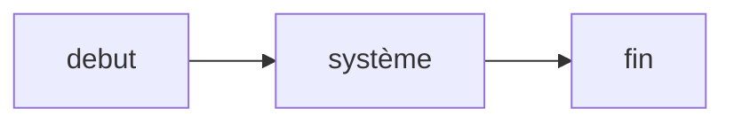

# FFB-RFID

Le projet pour le Festival du Fantastique de Béziers 2023 où l'on va utiliser des cartes RFID et du LoRa.

Il est séparé en deux parties:

- Le profilage + insertion des cartes RFID dans le système : @alexis-opolka @LucasSimpol
- L'identification Profil par ID de cartes RFID + traitement des actions / données: @Bastien-Helec @ThibaultGarcia

## Guidelines

Quand vous travaillez pour une issue / de votre coté, veuillez faire une branche séparée
puis créez une Pull Request afin que quelqu'un donne son avis avant de combiner votre
travail dans la branche main.

## FFB-Watcher

> Quand le Festival du Fantastique de Béziers rencontre
> la SAE-24 du département R&T.

### Infrastructure du projet FFB-Watcher

