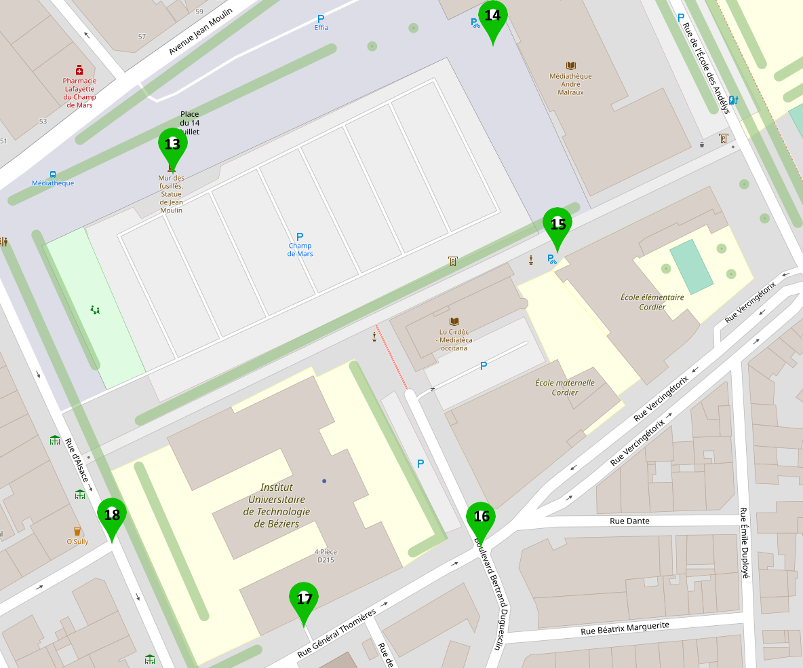

# Couverture des Gateways LoRa présentes à l'IUT

__Légende :__

La localisation correspond au Point X sur la carte.

Dénommination|gateway_id
-|-
B204|eui-0080000000021b9e
SPACE LAB|eui-0080000000081ba1
RDC|eui-0080000000021ba4
PARKING|eui-0080000000085ca1
En théorie les gateway sont bien identifiées MAIS nous n'y avons pas d'accès direct donc c'est seulement une supposition avec nos mesures et en connaissant vaguement leur emplacement au sein de l'IUT.

Localisation|Gateway|RSSI (dBm)|SNR|
-|-|-|-|
Point 1|B204|-41|7.8
||SPACE LAB|-72|7.2
||RDC|-99|6.5
||||
Point 2|RDC|-83|10.2
||SPACE LAB|-81|10.2
||B204|-78|9.5
||||
Point 3|PARKING|-97|6
||RDC|-102|6.5
||SPACE LAB|-77|9.5
||B204|-91|9.5
||||
Point 4|B204|-93|8.8
||SPACE LAB|-97|8.5
||RDC|-99|9.2
||PARKING|-98|7.2
||||
Point 5|SPACE LAB|-95|-1.2
||B204|-101|-7.8
||||
Point 6|B204|-110|0.8
||SPACE LAB|-108|6.2
||PARKING|-108|-1.2
||||
Point 7|RDC|-89|7.5
||PARKING|-93|7
||SPACE LAB|-93|7
||||
Point 8|SPACE LAB|-105|7.5
||PARKING|-91|9.2
||B204|-109|-2.8
||||
Point 9|SPACE LAB|-91|10.2
||PARKING|-104|4.5
||B204|-101|7.2
||RDC|-81|10.8
||||
Point 10|RDC|-59|9.5
||SPACE LAB|-80|9.8
||B204|-96|7.8
||PARKING|-99|7.8
|||
Point 11|SPACE LAB|-86|2.5
||PARKING|-83|7.2
||RDC|-82|7.5
|||
Point 12|SPACE LAB|-103|5.8
||PARKING|-80|7.8
||RDC|-83|7.8
|||
Point 13|SPACE LAB|-93|10.2
||B204|-109|0.2
||RDC|-95|10.8
|||
Point 14|RDC|-104|8
||SPACE LAB|-99|9.2
||B204|-99|8
|||
Point 15|SPACE LAB|-106|-1.8
||B204|-108|-9.2
||RDC|-105|2.5
|||
Point 16|B204|-113|-7.2
||SPACE LAB|-107|6
||PARKING|-108|2.5
||RDC|-113|-2
|||
Point 17|SPACE LAB|-97|8.2
||B204|-107|-3.8
||PARKING|-95|8.8
|||
Point 18|SPACE LAB|-91|10.5
||RDC|-111|3
||B204|-86|8.5
|||
Point 19|RDC|-65|9.2
||SPACE LAB|-85|9.5
||B204|-93|8.8
||PARKING|-100|5.5
