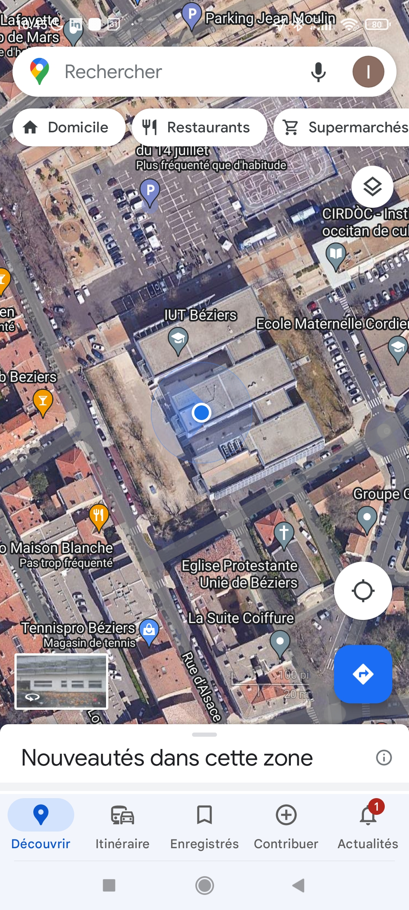
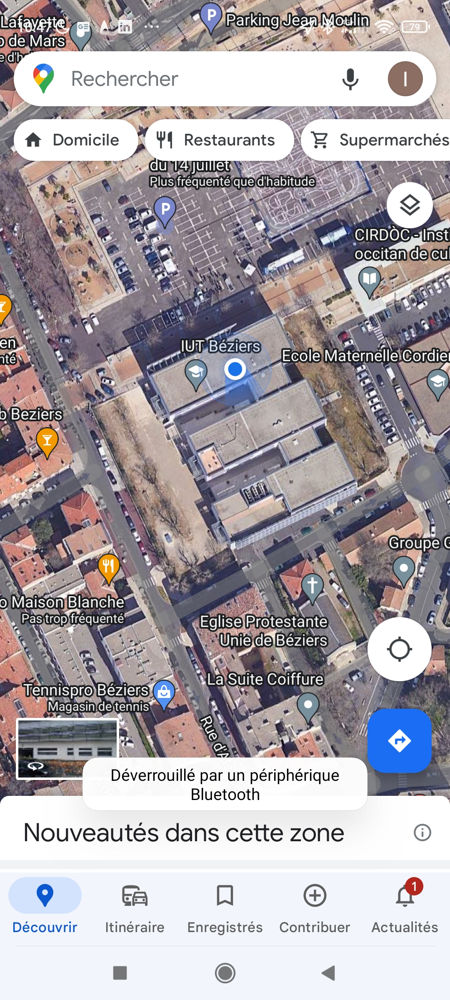
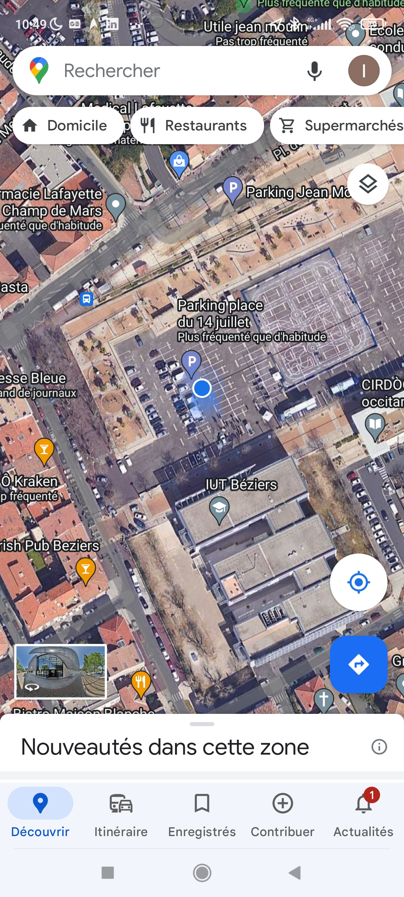
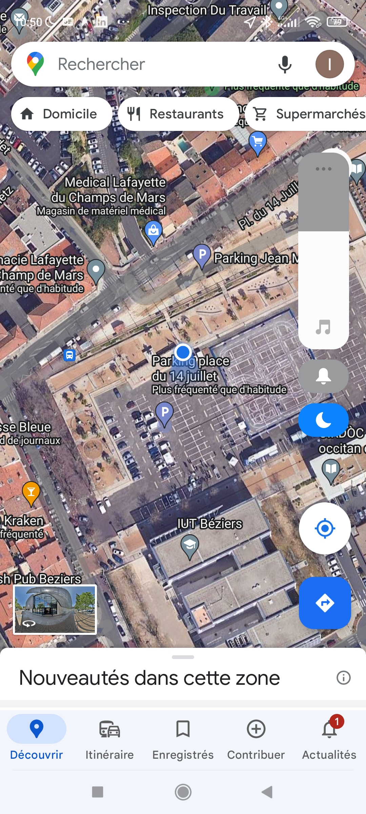
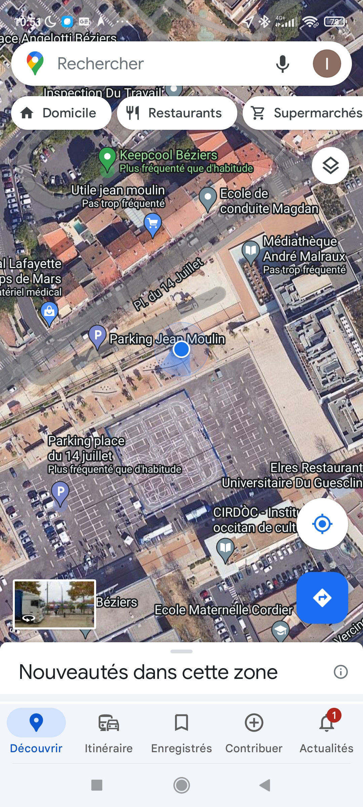
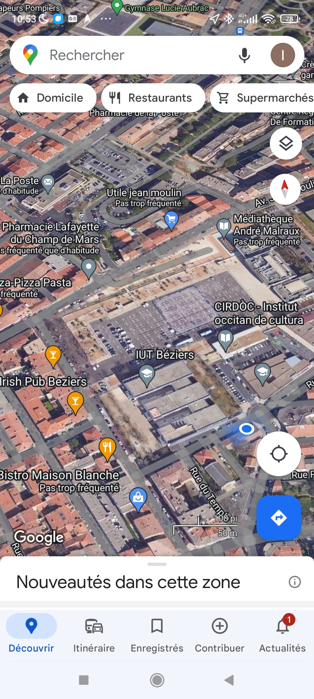

# info_couverture

----

salle 204 salle projet

```json
{
    "end_device_ids": {
        "device_id": "rftrack-02",
        "application_ids": {
            "application_id": "iutb-sae204-2023"
        },
        "dev_eui": "70B3D5E820002D6B",
        "join_eui": "70B3D5E820000018",
        "dev_addr": "260B9949"
    },
    "correlation_ids": [
        "as:up:01H2WH7P86HFSMW4S3J6HGVHRG",
        "gs:conn:01H2TY39VBGGTG7J1H6N53EWKK",
        "gs:up:host:01H2TY39VFVK0JA4J18XXXX8F0",
        "gs:uplink:01H2WH7P1DKY6KKY90V5XDXQ0K",
        "ns:uplink:01H2WH7P1EF0F3H8JX7E5ZMPZM",
        "rpc:/ttn.lorawan.v3.GsNs/HandleUplink:01H2WH7P1E8WSGDTFM8CE9WS4J",
        "rpc:/ttn.lorawan.v3.NsAs/HandleUplink:01H2WH7P86KZCGXSYPX1TVX290"
    ],
    "received_at": "2023-06-14T08:44:25.734494512Z",
    "uplink_message": {
        "session_key_id": "AYigveChadIZh5O4xgqvag==",
        "f_port": 1,
        "f_cnt": 148,
        "frm_payload": "TmSJffMEyQTnog==",
        "rx_metadata": [
            {
                "gateway_ids": {
                    "gateway_id": "eui-0080000000081ba1",
                    "eui": "0080000000021BA1"
                },
                "timestamp": 2275644851,
                "rssi": -82,
                "channel_rssi": -82,
                "snr": 6.8,
                "location": {
                    "latitude": 43.3466573242713,
                    "longitude": 3.22212634656434,
                    "altitude": 70,
                    "source": "SOURCE_REGISTRY"
                },
                "uplink_token": "CiIKIAoUZXVpLTAwODAwMDAwMDAwODFiYTESCACAAAAAAhuhELOrjr0IGgwI6fulpAYQ3K/j9gEguIaDuJ2eDA==",
                "channel_index": 2,
                "received_at": "2023-06-14T08:44:25.500925080Z"
            },
            {
                "gateway_ids": {
                    "gateway_id": "eui-0080000000021ba4",
                    "eui": "0080000000021BA4"
                },
                "timestamp": 3459304043,
                "rssi": -104,
                "channel_rssi": -104,
                "snr": -1.8,
                "location": {
                    "latitude": 43.346651949768,
                    "longitude": 3.22262624614003,
                    "altitude": 70,
                    "source": "SOURCE_REGISTRY"
                },
                "uplink_token": "CiIKIAoUZXVpLTAwODAwMDAwMDAwMjFiYTQSCACAAAAAAhukEOuUw/EMGgwI6fulpAYQ/+im9wEg+OPa9NbADA==",
                "channel_index": 2,
                "received_at": "2023-06-14T08:44:25.502729956Z"
            },
            {
                "gateway_ids": {
                    "gateway_id": "eui-0080000000021b9e",
                    "eui": "0080000000021B9E"
                },
                "timestamp": 3267485779,
                "rssi": -38,
                "channel_rssi": -38,
                "snr": 6.5,
                "location": {
                    "latitude": 43.346848796372,
                    "longitude": 3.22198270039729,
                    "altitude": 70,
                    "source": "SOURCE_REGISTRY"
                },
                "uplink_token": "CiIKIAoUZXVpLTAwODAwMDAwMDAwMjFiOWUSCACAAAAAAhueENPAh5YMGgwI6fulpAYQk9vm+AEguIjRqoy7DA==",
                "channel_index": 2,
                "received_at": "2023-06-14T08:44:25.504945527Z"
            }
        ],
        "settings": {
            "data_rate": {
                "lora": {
                    "bandwidth": 125000,
                    "spreading_factor": 7,
                    "coding_rate": "4/5"
                }
            },
            "frequency": "868500000",
            "timestamp": 2275644851
        },
        "received_at": "2023-06-14T08:44:25.518580080Z",
        "confirmed": true,
        "consumed_airtime": "0.061696s",
        "network_ids": {
            "net_id": "000013",
            "tenant_id": "ttn",
            "cluster_id": "eu1",
            "cluster_address": "eu1.cloud.thethings.network"
        }
    }
}
```

salle SpaceLab


```json
{
    "end_device_ids": {
        "device_id": "rftrack-02",
        "application_ids": {
            "application_id": "iutb-sae204-2023"
        },
        "dev_eui": "70B3D5E820002D6B",
        "join_eui": "70B3D5E820000018",
        "dev_addr": "260B9949"
    },
    "correlation_ids": [
        "as:up:01H2WH9PS6W7HEA0ZEBNPHSGVE",
        "gs:conn:01H2TYE9S52QDV7ZZQ5YXF777A",
        "gs:up:host:01H2TYE9SD91YNFAYT1152TRD6",
        "gs:uplink:01H2WH9PJQC54NRKC4PB4767A8",
        "ns:uplink:01H2WH9PJR1PFPMNA86TXSW4Q8",
        "rpc:/ttn.lorawan.v3.GsNs/HandleUplink:01H2WH9PJR9DZVMNVS2N288ZK6",
        "rpc:/ttn.lorawan.v3.NsAs/HandleUplink:01H2WH9PS5787CZ1SJBA4JK1FD"
    ],
    "received_at": "2023-06-14T08:45:31.813743845Z",
    "uplink_message": {
        "session_key_id": "AYigveChadIZh5O4xgqvag==",
        "f_port": 1,
        "f_cnt": 149,
        "frm_payload": "TmSJfjUEyQTnog==",
        "rx_metadata": [
            {
                "gateway_ids": {
                    "gateway_id": "eui-0080000000021b9e",
                    "eui": "0080000000021B9E"
                },
                "timestamp": 3333577827,
                "rssi": -80,
                "channel_rssi": -80,
                "snr": 9.2,
                "location": {
                    "latitude": 43.346848796372,
                    "longitude": 3.22198270039729,
                    "altitude": 70,
                    "source": "SOURCE_REGISTRY"
                },
                "uplink_token": "CiIKIAoUZXVpLTAwODAwMDAwMDAwMjFiOWUSCACAAAAAAhueEOO4ybUMGgwIq/ylpAYQ15XFoQIguMXjxYK9DA==",
                "channel_index": 4,
                "received_at": "2023-06-14T08:45:31.590398439Z"
            },
            {
                "gateway_ids": {
                    "gateway_id": "eui-0080000000081ba1",
                    "eui": "0080000000021BA1"
                },
                "timestamp": 2341736891,
                "rssi": -81,
                "channel_rssi": -81,
                "snr": 9.5,
                "location": {
                    "latitude": 43.3466573242713,
                    "longitude": 3.22212634656434,
                    "altitude": 70,
                    "source": "SOURCE_REGISTRY"
                },
                "uplink_token": "CiIKIAoUZXVpLTAwODAwMDAwMDAwODFiYTESCACAAAAAAhuhELuj0NwIGgwIq/ylpAYQsMK0oQIg+ISV05OgDA==",
                "channel_index": 4,
                "received_at": "2023-06-14T08:45:31.590340703Z"
            },
            {
                "gateway_ids": {
                    "gateway_id": "eui-0080000000021ba3",
                    "eui": "0080000000021BA3"
                },
                "timestamp": 3123015683,
                "rssi": -102,
                "channel_rssi": -102,
                "snr": 6.8,
                "location": {
                    "latitude": 43.3464359432239,
                    "longitude": 3.22250973257431,
                    "altitude": 55,
                    "source": "SOURCE_REGISTRY"
                },
                "uplink_token": "CiIKIAoUZXVpLTAwODAwMDAwMDAwMjFiYTMSCACAAAAAAhujEIPgldELGgwIq/ylpAYQwO+YowIguJf2kfK2DA==",
                "channel_index": 4,
                "received_at": "2023-06-14T08:45:31.594906756Z"
            },
            {
                "gateway_ids": {
                    "gateway_id": "eui-0080000000085ca1",
                    "eui": "0080000000025CA1"
                },
                "timestamp": 1388110115,
                "rssi": -108,
                "channel_rssi": -108,
                "snr": -3.8,
                "location": {
                    "latitude": 43.3469890483734,
                    "longitude": 3.22234607696029,
                    "altitude": 60,
                    "source": "SOURCE_REGISTRY"
                },
                "uplink_token": "CiIKIAoUZXVpLTAwODAwMDAwMDAwODVjYTESCACAAAAAAlyhEKPC85UFGgwIq/ylpAYQnPD/owIguOG9jrOBDQ==",
                "channel_index": 4,
                "received_at": "2023-06-14T08:45:31.596460733Z"
            },
            {
                "gateway_ids": {
                    "gateway_id": "eui-0080000000021ba4",
                    "eui": "0080000000021BA4"
                },
                "timestamp": 3525396083,
                "rssi": -107,
                "channel_rssi": -107,
                "snr": 4.5,
                "location": {
                    "latitude": 43.346651949768,
                    "longitude": 3.22262624614003,
                    "altitude": 70,
                    "source": "SOURCE_REGISTRY"
                },
                "uplink_token": "CiIKIAoUZXVpLTAwODAwMDAwMDAwMjFiYTQSCACAAAAAAhukEPOMhZENGgwIq/ylpAYQ/arKpAIguOLsj83CDA==",
                "channel_index": 4,
                "received_at": "2023-06-14T08:45:31.597661328Z"
            }
        ],
        "settings": {
            "data_rate": {
                "lora": {
                    "bandwidth": 125000,
                    "spreading_factor": 7,
                    "coding_rate": "4/5"
                }
            },
            "frequency": "867300000",
            "timestamp": 3333577827
        },
        "received_at": "2023-06-14T08:45:31.608195636Z",
        "confirmed": true,
        "consumed_airtime": "0.061696s",
        "network_ids": {
            "net_id": "000013",
            "tenant_id": "ttn",
            "cluster_id": "eu1",
            "cluster_address": "eu1.cloud.thethings.network"
        }
    }
}
```

Atriun


```json
{
    "end_device_ids": {
        "device_id": "rftrack-02",
        "application_ids": {
            "application_id": "iutb-sae204-2023"
        },
        "dev_eui": "70B3D5E820002D6B",
        "join_eui": "70B3D5E820000018",
        "dev_addr": "260B9949"
    },
    "correlation_ids": [
        "as:up:01H2WHCEH05G3KG4EM8YQTJ9M2",
        "gs:conn:01H2TY39VBGGTG7J1H6N53EWKK",
        "gs:up:host:01H2TY39VFVK0JA4J18XXXX8F0",
        "gs:uplink:01H2WHCEAHKGMDDCK3F3N4FCG8",
        "ns:uplink:01H2WHCEAJH7N8XJD55DEB9R5Z",
        "rpc:/ttn.lorawan.v3.GsNs/HandleUplink:01H2WHCEAJRDWZCEMCSWVR4WFJ",
        "rpc:/ttn.lorawan.v3.NsAs/HandleUplink:01H2WHCEGZ07TQ1W1ZJX06VS9Q"
    ],
    "received_at": "2023-06-14T08:47:01.663468338Z",
    "uplink_message": {
        "session_key_id": "AYigveChadIZh5O4xgqvag==",
        "f_port": 1,
        "f_cnt": 150,
        "frm_payload": "TmSJfo8EyQTnog==",
        "rx_metadata": [
            {
                "gateway_ids": {
                    "gateway_id": "eui-0080000000081ba1",
                    "eui": "0080000000021BA1"
                },
                "timestamp": 2431583147,
                "rssi": -79,
                "channel_rssi": -79,
                "snr": 9.5,
                "location": {
                    "latitude": 43.3466573242713,
                    "longitude": 3.22212634656434,
                    "altitude": 70,
                    "source": "SOURCE_REGISTRY"
                },
                "uplink_token": "CiIKIAoUZXVpLTAwODAwMDAwMDAwODFiYTESCACAAAAAAhuhEKuHvIcJGgwIhf2lpAYQ48762QEg+KeZreKiDA==",
                "channel_index": 4,
                "received_at": "2023-06-14T08:47:01.440494226Z"
            },
            {
                "gateway_ids": {
                    "gateway_id": "eui-0080000000021ba4",
                    "eui": "0080000000021BA4"
                },
                "timestamp": 3615242331,
                "rssi": -57,
                "channel_rssi": -57,
                "snr": 9,
                "location": {
                    "latitude": 43.346651949768,
                    "longitude": 3.22262624614003,
                    "altitude": 70,
                    "source": "SOURCE_REGISTRY"
                },
                "uplink_token": "CiIKIAoUZXVpLTAwODAwMDAwMDAwMjFiYTQSCACAAAAAAhukENvw8LsNGgwIhf2lpAYQnKiD2wEg+Mbw6ZvFDA==",
                "channel_index": 4,
                "received_at": "2023-06-14T08:47:01.443405615Z"
            },
            {
                "gateway_ids": {
                    "gateway_id": "eui-0080000000085ca1",
                    "eui": "0080000000025CA1"
                },
                "timestamp": 1477956347,
                "rssi": -95,
                "channel_rssi": -95,
                "snr": 8.2,
                "location": {
                    "latitude": 43.3469890483734,
                    "longitude": 3.22234607696029,
                    "altitude": 60,
                    "source": "SOURCE_REGISTRY"
                },
                "uplink_token": "CiIKIAoUZXVpLTAwODAwMDAwMDAwODVjYTESCACAAAAAAlyhEPul38AFGgwIhf2lpAYQpMyt2wEg+MjA6IGEDQ==",
                "channel_index": 4,
                "received_at": "2023-06-14T08:47:01.444117701Z"
            },
            {
                "gateway_ids": {
                    "gateway_id": "eui-0080000000021b9e",
                    "eui": "0080000000021B9E"
                },
                "timestamp": 3423424075,
                "rssi": -89,
                "channel_rssi": -89,
                "snr": 9,
                "location": {
                    "latitude": 43.346848796372,
                    "longitude": 3.22198270039729,
                    "altitude": 70,
                    "source": "SOURCE_REGISTRY"
                },
                "uplink_token": "CiIKIAoUZXVpLTAwODAwMDAwMDAwMjFiOWUSCACAAAAAAhueEMucteAMGgwIhf2lpAYQxv3q2wEg+Knnn9G/DA==",
                "channel_index": 4,
                "received_at": "2023-06-14T08:47:01.444217564Z"
            }
        ],
        "settings": {
            "data_rate": {
                "lora": {
                    "bandwidth": 125000,
                    "spreading_factor": 7,
                    "coding_rate": "4/5"
                }
            },
            "frequency": "867300000",
            "timestamp": 2431583147
        },
        "received_at": "2023-06-14T08:47:01.458172500Z",
        "confirmed": true,
        "consumed_airtime": "0.061696s",
        "network_ids": {
            "net_id": "000013",
            "tenant_id": "ttn",
            "cluster_id": "eu1",
            "cluster_address": "eu1.cloud.thethings.network"
        }
    }
}
```

parking centre


```json
{
    "end_device_ids": {
        "device_id": "rftrack-02",
        "application_ids": {
            "application_id": "iutb-sae204-2023"
        },
        "dev_eui": "70B3D5E820002D6B",
        "join_eui": "70B3D5E820000018",
        "dev_addr": "260B9949"
    },
    "correlation_ids": [
        "as:up:01H2WHHJB1KSXKP64VG54SDZEY",
        "gs:conn:01H2TY8ST6AN2TXDNJ5XRPTBNP",
        "gs:up:host:01H2TY8STAY8EESP10368ZHV4K",
        "gs:uplink:01H2WHHJ4JA9TZDBX7MK6VMZ5X",
        "ns:uplink:01H2WHHJ4KHPM5J36KYMJT21C5",
        "rpc:/ttn.lorawan.v3.GsNs/HandleUplink:01H2WHHJ4KTB5RB8TGKWHKKTDM",
        "rpc:/ttn.lorawan.v3.NsAs/HandleUplink:01H2WHHJB0DBNWBBAKKFCFC2EV"
    ],
    "received_at": "2023-06-14T08:49:49.408457022Z",
    "uplink_message": {
        "session_key_id": "AYigveChadIZh5O4xgqvag==",
        "f_port": 1,
        "f_cnt": 151,
        "frm_payload": "TmSJfzcEyQTnog==",
        "rx_metadata": [
            {
                "gateway_ids": {
                    "gateway_id": "eui-0080000000021ba4",
                    "eui": "0080000000021BA4"
                },
                "timestamp": 3782987492,
                "rssi": -89,
                "channel_rssi": -89,
                "snr": 7.5,
                "location": {
                    "latitude": 43.346651949768,
                    "longitude": 3.22262624614003,
                    "altitude": 70,
                    "source": "SOURCE_REGISTRY"
                },
                "uplink_token": "CiIKIAoUZXVpLTAwODAwMDAwMDAwMjFiYTQSCACAAAAAAhukEOSd74sOGgsIrf6lpAYQxtXAYCCg1YDdjMoM",
                "channel_index": 5,
                "received_at": "2023-06-14T08:49:49.186467345Z"
            },
            {
                "gateway_ids": {
                    "gateway_id": "eui-0080000000081ba1",
                    "eui": "0080000000021BA1"
                },
                "timestamp": 2599328332,
                "rssi": -101,
                "channel_rssi": -101,
                "snr": 5.8,
                "location": {
                    "latitude": 43.3466573242713,
                    "longitude": 3.22212634656434,
                    "altitude": 70,
                    "source": "SOURCE_REGISTRY"
                },
                "uplink_token": "CiIKIAoUZXVpLTAwODAwMDAwMDAwODFiYTESCACAAAAAAhuhEMy0utcJGgsIrf6lpAYQnJfxYiDg8aqg06cM",
                "channel_index": 5,
                "received_at": "2023-06-14T08:49:49.190778571Z"
            },
            {
                "gateway_ids": {
                    "gateway_id": "eui-0080000000021ba3",
                    "eui": "0080000000021BA3"
                },
                "timestamp": 3380607124,
                "rssi": -109,
                "channel_rssi": -109,
                "snr": -0.5,
                "location": {
                    "latitude": 43.3464359432239,
                    "longitude": 3.22250973257431,
                    "altitude": 55,
                    "source": "SOURCE_REGISTRY"
                },
                "uplink_token": "CiIKIAoUZXVpLTAwODAwMDAwMDAwMjFiYTMSCACAAAAAAhujEJTx/8sMGgsIrf6lpAYQnLCRYyCghIzfsb4M",
                "channel_index": 5,
                "received_at": "2023-06-14T08:49:49.207902748Z"
            },
            {
                "gateway_ids": {
                    "gateway_id": "eui-0080000000021b9e",
                    "eui": "0080000000021B9E"
                },
                "timestamp": 3591169252,
                "rssi": -105,
                "channel_rssi": -105,
                "snr": -5,
                "location": {
                    "latitude": 43.346848796372,
                    "longitude": 3.22198270039729,
                    "altitude": 70,
                    "source": "SOURCE_REGISTRY"
                },
                "uplink_token": "CiIKIAoUZXVpLTAwODAwMDAwMDAwMjFiOWUSCACAAAAAAhueEOTJs7ANGgsIrf6lpAYQ1ryyYyCgtfiSwsQM",
                "channel_index": 5,
                "received_at": "2023-06-14T08:49:49.191633516Z"
            }
        ],
        "settings": {
            "data_rate": {
                "lora": {
                    "bandwidth": 125000,
                    "spreading_factor": 7,
                    "coding_rate": "4/5"
                }
            },
            "frequency": "867500000",
            "timestamp": 3782987492
        },
        "received_at": "2023-06-14T08:49:49.203584537Z",
        "confirmed": true,
        "consumed_airtime": "0.061696s",
        "network_ids": {
            "net_id": "000013",
            "tenant_id": "ttn",
            "cluster_id": "eu1",
            "cluster_address": "eu1.cloud.thethings.network"
        }
    }
}
```

parking fon de parking face iut


```json
{
    "end_device_ids": {
        "device_id": "rftrack-02",
        "application_ids": {
            "application_id": "iutb-sae204-2023"
        },
        "dev_eui": "70B3D5E820002D6B",
        "join_eui": "70B3D5E820000018",
        "dev_addr": "260B9949"
    },
    "correlation_ids": [
        "as:up:01H2WHJKHV06JCM214H09AE2VT",
        "gs:conn:01H2TY39VBGGTG7J1H6N53EWKK",
        "gs:up:host:01H2TY39VFVK0JA4J18XXXX8F0",
        "gs:uplink:01H2WHJKBCKTWCXSZQJ8544VVW",
        "ns:uplink:01H2WHJKBD1JJ8ZGSY2Z9FKTHA",
        "rpc:/ttn.lorawan.v3.GsNs/HandleUplink:01H2WHJKBD0YYCYM5TGQGYHJ0W",
        "rpc:/ttn.lorawan.v3.NsAs/HandleUplink:01H2WHJKHT2N2N8PAV4VA5DJMD"
    ],
    "received_at": "2023-06-14T08:50:23.419049578Z",
    "uplink_message": {
        "session_key_id": "AYigveChadIZh5O4xgqvag==",
        "f_port": 1,
        "f_cnt": 152,
        "frm_payload": "TmSJf1kEyQTnog==",
        "rx_metadata": [
            {
                "gateway_ids": {
                    "gateway_id": "eui-0080000000081ba1",
                    "eui": "0080000000021BA1"
                },
                "timestamp": 2633340684,
                "rssi": -89,
                "channel_rssi": -89,
                "snr": 9,
                "location": {
                    "latitude": 43.3466573242713,
                    "longitude": 3.22212634656434,
                    "altitude": 70,
                    "source": "SOURCE_REGISTRY"
                },
                "uplink_token": "CiIKIAoUZXVpLTAwODAwMDAwMDAwODFiYTESCACAAAAAAhuhEIyu1ucJGgsIz/6lpAYQyO+YZSDgjdj60agM",
                "channel_index": 6,
                "received_at": "2023-06-14T08:50:23.195623159Z"
            },
            {
                "gateway_ids": {
                    "gateway_id": "eui-0080000000021ba4",
                    "eui": "0080000000021BA4"
                },
                "timestamp": 3816999844,
                "rssi": -90,
                "channel_rssi": -90,
                "snr": 9,
                "location": {
                    "latitude": 43.346651949768,
                    "longitude": 3.22262624614003,
                    "altitude": 70,
                    "source": "SOURCE_REGISTRY"
                },
                "uplink_token": "CiIKIAoUZXVpLTAwODAwMDAwMDAwMjFiYTQSCACAAAAAAhukEKSXi5wOGgsIz/6lpAYQyZzNZSCg8a23i8sM",
                "channel_index": 6,
                "received_at": "2023-06-14T08:50:23.197165004Z"
            },
            {
                "gateway_ids": {
                    "gateway_id": "eui-0080000000021ba3",
                    "eui": "0080000000021BA3"
                },
                "timestamp": 3414619476,
                "rssi": -105,
                "channel_rssi": -105,
                "snr": 5,
                "location": {
                    "latitude": 43.3464359432239,
                    "longitude": 3.22250973257431,
                    "altitude": 55,
                    "source": "SOURCE_REGISTRY"
                },
                "uplink_token": "CiIKIAoUZXVpLTAwODAwMDAwMDAwMjFiYTMSCACAAAAAAhujENTqm9wMGgsIz/6lpAYQw4uSaSCgoLm5sL8M",
                "channel_index": 6,
                "received_at": "2023-06-14T08:50:23.220497347Z"
            },
            {
                "gateway_ids": {
                    "gateway_id": "eui-0080000000021b9e",
                    "eui": "0080000000021B9E"
                },
                "timestamp": 3625181596,
                "rssi": -93,
                "channel_rssi": -93,
                "snr": 1.8,
                "location": {
                    "latitude": 43.346848796372,
                    "longitude": 3.22198270039729,
                    "altitude": 70,
                    "source": "SOURCE_REGISTRY"
                },
                "uplink_token": "CiIKIAoUZXVpLTAwODAwMDAwMDAwMjFiOWUSCACAAAAAAhueEJzDz8ANGgsIz/6lpAYQtfWeaSDgkqXtwMUM",
                "channel_index": 6,
                "received_at": "2023-06-14T08:50:23.203896011Z"
            }
        ],
        "settings": {
            "data_rate": {
                "lora": {
                    "bandwidth": 125000,
                    "spreading_factor": 7,
                    "coding_rate": "4/5"
                }
            },
            "frequency": "867700000",
            "timestamp": 2633340684
        },
        "received_at": "2023-06-14T08:50:23.213316090Z",
        "confirmed": true,
        "consumed_airtime": "0.061696s",
        "network_ids": {
            "net_id": "000013",
            "tenant_id": "ttn",
            "cluster_id": "eu1",
            "cluster_address": "eu1.cloud.thethings.network"
        }
    }
}
```

parking coté médiateque


```json
{
    "end_device_ids": {
        "device_id": "rftrack-02",
        "application_ids": {
            "application_id": "iutb-sae204-2023"
        },
        "dev_eui": "70B3D5E820002D6B",
        "join_eui": "70B3D5E820000018",
        "dev_addr": "260B9949"
    },
    "correlation_ids": [
        "as:up:01H2WHMYRAJC6JKQSWJ8CWFT24",
        "gs:conn:01H2TY39VBGGTG7J1H6N53EWKK",
        "gs:up:host:01H2TY39VFVK0JA4J18XXXX8F0",
        "gs:uplink:01H2WHMYHKRQWZ0VVXNNW57WNZ",
        "ns:uplink:01H2WHMYHMG22FXSP2GJNYJWRE",
        "rpc:/ttn.lorawan.v3.GsNs/HandleUplink:01H2WHMYHMQK8GQHFP8VGHE0FJ",
        "rpc:/ttn.lorawan.v3.NsAs/HandleUplink:01H2WHMYR9PMBZE5WQR41AC4K6"
    ],
    "received_at": "2023-06-14T08:51:40.425812753Z",
    "uplink_message": {
        "session_key_id": "AYigveChadIZh5O4xgqvag==",
        "f_port": 1,
        "f_cnt": 153,
        "frm_payload": "TmSJf6YEyQTnog==",
        "rx_metadata": [
            {
                "gateway_ids": {
                    "gateway_id": "eui-0080000000081ba1",
                    "eui": "0080000000021BA1"
                },
                "timestamp": 2710340236,
                "rssi": -99,
                "channel_rssi": -99,
                "snr": 9.2,
                "location": {
                    "latitude": 43.3466573242713,
                    "longitude": 3.22212634656434,
                    "altitude": 70,
                    "source": "SOURCE_REGISTRY"
                },
                "uplink_token": "CiIKIAoUZXVpLTAwODAwMDAwMDAwODFiYTESCACAAAAAAhuhEIyFsowKGgsInP+lpAYQpvvvZCDg5ffm8KoM",
                "channel_index": 6,
                "received_at": "2023-06-14T08:51:40.194947170Z"
            },
            {
                "gateway_ids": {
                    "gateway_id": "eui-0080000000021ba3",
                    "eui": "0080000000021BA3"
                },
                "timestamp": 3491619028,
                "rssi": -109,
                "channel_rssi": -109,
                "snr": 1.5,
                "location": {
                    "latitude": 43.3464359432239,
                    "longitude": 3.22250973257431,
                    "altitude": 55,
                    "source": "SOURCE_REGISTRY"
                },
                "uplink_token": "CiIKIAoUZXVpLTAwODAwMDAwMDAwMjFiYTMSCACAAAAAAhujENTB94ANGgsInP+lpAYQzM6rZiCg+Nilz8EM",
                "channel_index": 6,
                "received_at": "2023-06-14T08:51:40.214624076Z"
            },
            {
                "gateway_ids": {
                    "gateway_id": "eui-0080000000021ba4",
                    "eui": "0080000000021BA4"
                },
                "timestamp": 3893999380,
                "rssi": -104,
                "channel_rssi": -104,
                "snr": 4.5,
                "location": {
                    "latitude": 43.346651949768,
                    "longitude": 3.22262624614003,
                    "altitude": 70,
                    "source": "SOURCE_REGISTRY"
                },
                "uplink_token": "CiIKIAoUZXVpLTAwODAwMDAwMDAwMjFiYTQSCACAAAAAAhukEJTu5sAOGgsInP+lpAYQ173SZyCgzMyjqs0M",
                "channel_index": 6,
                "received_at": "2023-06-14T08:51:40.201445466Z"
            },
            {
                "gateway_ids": {
                    "gateway_id": "eui-0080000000021b9e",
                    "eui": "0080000000021B9E"
                },
                "timestamp": 3702181148,
                "rssi": -99,
                "channel_rssi": -99,
                "snr": 3.2,
                "location": {
                    "latitude": 43.346848796372,
                    "longitude": 3.22198270039729,
                    "altitude": 70,
                    "source": "SOURCE_REGISTRY"
                },
                "uplink_token": "CiIKIAoUZXVpLTAwODAwMDAwMDAwMjFiOWUSCACAAAAAAhueEJyaq+UNGgsInP+lpAYQt8abaCDg6sTZ38cM",
                "channel_index": 6,
                "received_at": "2023-06-14T08:51:40.201743693Z"
            }
        ],
        "settings": {
            "data_rate": {
                "lora": {
                    "bandwidth": 125000,
                    "spreading_factor": 7,
                    "coding_rate": "4/5"
                }
            },
            "frequency": "867700000",
            "timestamp": 2710340236
        },
        "received_at": "2023-06-14T08:51:40.212977797Z",
        "confirmed": true,
        "consumed_airtime": "0.061696s",
        "network_ids": {
            "net_id": "000013",
            "tenant_id": "ttn",
            "cluster_id": "eu1",
            "cluster_address": "eu1.cloud.thethings.network"
        }
    }
}
```

rue droit IUT


```json
{
    "end_device_ids": {
        "device_id": "rftrack-02",
        "application_ids": {
            "application_id": "iutb-sae204-2023"
        },
        "dev_eui": "70B3D5E820002D6B",
        "join_eui": "70B3D5E820000018",
        "dev_addr": "260B9949"
    },
    "correlation_ids": [
        "as:up:01H2WHRW9P41KZ9WCY45T8VVPE",
        "gs:conn:01H2TY8ST6AN2TXDNJ5XRPTBNP",
        "gs:up:host:01H2TY8STAY8EESP10368ZHV4K",
        "gs:uplink:01H2WHRW352VX5HCP3VGWT9MQJ",
        "ns:uplink:01H2WHRW360YQYFGA0DJT57056",
        "rpc:/ttn.lorawan.v3.GsNs/HandleUplink:01H2WHRW36C06M36T6SCP7EH6V",
        "rpc:/ttn.lorawan.v3.NsAs/HandleUplink:01H2WHRW9NZFD4HQPNX5KF899S"
    ],
    "received_at": "2023-06-14T08:53:48.982122429Z",
    "uplink_message": {
        "session_key_id": "AYigveChadIZh5O4xgqvag==",
        "f_port": 1,
        "f_cnt": 154,
        "frm_payload": "TmSJgCcEyQTnog==",
        "rx_metadata": [
            {
                "gateway_ids": {
                    "gateway_id": "eui-0080000000021ba4",
                    "eui": "0080000000021BA4"
                },
                "timestamp": 4022562579,
                "rssi": -115,
                "channel_rssi": -115,
                "snr": -6.8,
                "location": {
                    "latitude": 43.346651949768,
                    "longitude": 3.22262624614003,
                    "altitude": 70,
                    "source": "SOURCE_REGISTRY"
                },
                "uplink_token": "CiIKIAoUZXVpLTAwODAwMDAwMDAwMjFiYTQSCACAAAAAAhukEJPejf4OGgwInICmpAYQgcfk8AIguMSnm4nRDA==",
                "channel_index": 4,
                "received_at": "2023-06-14T08:53:48.757474452Z"
            },
            {
                "gateway_ids": {
                    "gateway_id": "eui-0080000000021ba3",
                    "eui": "0080000000021BA3"
                },
                "timestamp": 3620182243,
                "rssi": -109,
                "channel_rssi": -109,
                "snr": 1.8,
                "location": {
                    "latitude": 43.3464359432239,
                    "longitude": 3.22250973257431,
                    "altitude": 55,
                    "source": "SOURCE_REGISTRY"
                },
                "uplink_token": "CiIKIAoUZXVpLTAwODAwMDAwMDAwMjFiYTMSCACAAAAAAhujEOOxnr4NGgwInICmpAYQtoqv8QIguO20na7FDA==",
                "channel_index": 4,
                "received_at": "2023-06-14T08:53:48.758859867Z"
            },
            {
                "gateway_ids": {
                    "gateway_id": "eui-0080000000021b9e",
                    "eui": "0080000000021B9E"
                },
                "timestamp": 3830744347,
                "rssi": -107,
                "channel_rssi": -107,
                "snr": -4.5,
                "location": {
                    "latitude": 43.346848796372,
                    "longitude": 3.22198270039729,
                    "altitude": 70,
                    "source": "SOURCE_REGISTRY"
                },
                "uplink_token": "CiIKIAoUZXVpLTAwODAwMDAwMDAwMjFiOWUSCACAAAAAAhueEJuK0qIOGgwInICmpAYQtduy8gIg+OKf0b7LDA==",
                "channel_index": 4,
                "received_at": "2023-06-14T08:53:48.759965381Z"
            },
            {
                "gateway_ids": {
                    "gateway_id": "eui-0080000000085ca1",
                    "eui": "0080000000025CA1"
                },
                "timestamp": 1885276531,
                "rssi": -97,
                "channel_rssi": -97,
                "snr": 7.5,
                "location": {
                    "latitude": 43.3469890483734,
                    "longitude": 3.22234607696029,
                    "altitude": 60,
                    "source": "SOURCE_REGISTRY"
                },
                "uplink_token": "CiIKIAoUZXVpLTAwODAwMDAwMDAwODVjYTESCACAAAAAAlyhEPOS/IIHGgwInICmpAYQqLzw8gIguNLzme+PDQ==",
                "channel_index": 4,
                "received_at": "2023-06-14T08:53:48.761848861Z"
            }
        ],
        "settings": {
            "data_rate": {
                "lora": {
                    "bandwidth": 125000,
                    "spreading_factor": 7,
                    "coding_rate": "4/5"
                }
            },
            "frequency": "867300000",
            "timestamp": 4022562579
        },
        "received_at": "2023-06-14T08:53:48.774668203Z",
        "confirmed": true,
        "consumed_airtime": "0.061696s",
        "network_ids": {
            "net_id": "000013",
            "tenant_id": "ttn",
            "cluster_id": "eu1",
            "cluster_address": "eu1.cloud.thethings.network"
        }
    }
}
```

rue grauche IUT fond


```json
{
    "end_device_ids": {
        "device_id": "rftrack-02",
        "application_ids": {
            "application_id": "iutb-sae204-2023"
        },
        "dev_eui": "70B3D5E820002D6B",
        "join_eui": "70B3D5E820000018",
        "dev_addr": "260B9949"
    },
    "correlation_ids": [
        "as:up:01H2WHTT8Y5GGSTHD2VX29CH9S",
        "gs:conn:01H2TY638ASP9ZQP3C5XK1CT2G",
        "gs:up:host:01H2TY638HM5D0GQCQKR93DE0G",
        "gs:uplink:01H2WHTT2GGBG8VRQYW4ZPN0KM",
        "ns:uplink:01H2WHTT2GB7GD2W21H4MDMYEE",
        "rpc:/ttn.lorawan.v3.GsNs/HandleUplink:01H2WHTT2GGAXJ6KKK8KPBYGTP",
        "rpc:/ttn.lorawan.v3.NsAs/HandleUplink:01H2WHTT8XC00GA2XSG3X9YYM1"
    ],
    "received_at": "2023-06-14T08:54:52.446067763Z",
    "uplink_message": {
        "session_key_id": "AYigveChadIZh5O4xgqvag==",
        "f_port": 1,
        "f_cnt": 155,
        "frm_payload": "TmSJgGYEyQTnog==",
        "rx_metadata": [
            {
                "gateway_ids": {
                    "gateway_id": "eui-0080000000021ba3",
                    "eui": "0080000000021BA3"
                },
                "timestamp": 3683647396,
                "rssi": -110,
                "channel_rssi": -110,
                "snr": -0.2,
                "location": {
                    "latitude": 43.3464359432239,
                    "longitude": 3.22250973257431,
                    "altitude": 55,
                    "source": "SOURCE_REGISTRY"
                },
                "uplink_token": "CiIKIAoUZXVpLTAwODAwMDAwMDAwMjFiYTMSCACAAAAAAhujEKT/v9wNGgsI3ICmpAYQp66lciCgsfrTmscM",
                "channel_index": 6,
                "received_at": "2023-06-14T08:54:52.223926860Z"
            },
            {
                "gateway_ids": {
                    "gateway_id": "eui-0080000000021b9e",
                    "eui": "0080000000021B9E"
                },
                "timestamp": 3894209492,
                "rssi": -97,
                "channel_rssi": -97,
                "snr": 8,
                "location": {
                    "latitude": 43.346848796372,
                    "longitude": 3.22198270039729,
                    "altitude": 70,
                    "source": "SOURCE_REGISTRY"
                },
                "uplink_token": "CiIKIAoUZXVpLTAwODAwMDAwMDAwMjFiOWUSCACAAAAAAhueENTX88AOGgsI3ICmpAYQ/crtciCg6OSHq80M",
                "channel_index": 6,
                "received_at": "2023-06-14T08:54:52.224044898Z"
            },
            {
                "gateway_ids": {
                    "gateway_id": "eui-0080000000085ca1",
                    "eui": "0080000000025CA1"
                },
                "timestamp": 1948741668,
                "rssi": -107,
                "channel_rssi": -107,
                "snr": -1.2,
                "location": {
                    "latitude": 43.3469890483734,
                    "longitude": 3.22234607696029,
                    "altitude": 60,
                    "source": "SOURCE_REGISTRY"
                },
                "uplink_token": "CiIKIAoUZXVpLTAwODAwMDAwMDAwODVjYTESCACAAAAAAlyhEKTgnaEHGgsI3ICmpAYQuLyucyCgmbjQ25EN",
                "channel_index": 6,
                "received_at": "2023-06-14T08:54:52.226001523Z"
            },
            {
                "gateway_ids": {
                    "gateway_id": "eui-0080000000021ba4",
                    "eui": "0080000000021BA4"
                },
                "timestamp": 4086027724,
                "rssi": -109,
                "channel_rssi": -109,
                "snr": 0.8,
                "location": {
                    "latitude": 43.346651949768,
                    "longitude": 3.22262624614003,
                    "altitude": 70,
                    "source": "SOURCE_REGISTRY"
                },
                "uplink_token": "CiIKIAoUZXVpLTAwODAwMDAwMDAwMjFiYTQSCACAAAAAAhukEMyrr5wPGgsI3ICmpAYQ0JWKdCDgyezR9dIM",
                "channel_index": 6,
                "received_at": "2023-06-14T08:54:52.227523667Z"
            }
        ],
        "settings": {
            "data_rate": {
                "lora": {
                    "bandwidth": 125000,
                    "spreading_factor": 7,
                    "coding_rate": "4/5"
                }
            },
            "frequency": "867700000",
            "timestamp": 3683647396
        },
        "received_at": "2023-06-14T08:54:52.240906997Z",
        "confirmed": true,
        "consumed_airtime": "0.061696s",
        "network_ids": {
            "net_id": "000013",
            "tenant_id": "ttn",
            "cluster_id": "eu1",
            "cluster_address": "eu1.cloud.thethings.network"
        }
    }
}
```

rue gauche IUT avant


```json 
{
    "end_device_ids": {
        "device_id": "rftrack-02",
        "application_ids": {
            "application_id": "iutb-sae204-2023"
        },
        "dev_eui": "70B3D5E820002D6B",
        "join_eui": "70B3D5E820000018",
        "dev_addr": "260B9949"
    },
    "correlation_ids": [
        "as:up:01H2WHWMAZ0RCB6FGVA493HDM6",
        "gs:conn:01H2TYE9S52QDV7ZZQ5YXF777A",
        "gs:up:host:01H2TYE9SD91YNFAYT1152TRD6",
        "gs:uplink:01H2WHWM4GJ3WZAS072A2TEC49",
        "ns:uplink:01H2WHWM4HMACXQR86C7DR47MT",
        "rpc:/ttn.lorawan.v3.GsNs/HandleUplink:01H2WHWM4HDW3JQV8SEPVQTJT7",
        "rpc:/ttn.lorawan.v3.NsAs/HandleUplink:01H2WHWMAYBEF7NHCHXKHJG7Y3"
    ],
    "received_at": "2023-06-14T08:55:51.902670924Z",
    "uplink_message": {
        "session_key_id": "AYigveChadIZh5O4xgqvag==",
        "f_port": 1,
        "f_cnt": 156,
        "frm_payload": "TmSJgKIEyQTnog==",
        "rx_metadata": [
            {
                "gateway_ids": {
                    "gateway_id": "eui-0080000000021b9e",
                    "eui": "0080000000021B9E"
                },
                "timestamp": 3953667843,
                "rssi": -79,
                "channel_rssi": -79,
                "snr": 9.5,
                "location": {
                    "latitude": 43.346848796372,
                    "longitude": 3.22198270039729,
                    "altitude": 70,
                    "source": "SOURCE_REGISTRY"
                },
                "uplink_token": "CiIKIAoUZXVpLTAwODAwMDAwMDAwMjFiOWUSCACAAAAAAhueEIPeoN0OGgwIl4GmpAYQssyjzAIguMfex4jPDA==",
                "received_at": "2023-06-14T08:55:51.679993147Z"
            },
            {
                "gateway_ids": {
                    "gateway_id": "eui-0080000000021ba4",
                    "eui": "0080000000021BA4"
                },
                "timestamp": 4145486067,
                "rssi": -107,
                "channel_rssi": -107,
                "snr": 3.8,
                "location": {
                    "latitude": 43.346651949768,
                    "longitude": 3.22262624614003,
                    "altitude": 70,
                    "source": "SOURCE_REGISTRY"
                },
                "uplink_token": "CiIKIAoUZXVpLTAwODAwMDAwMDAwMjFiYTQSCACAAAAAAhukEPOx3LgPGgwIl4GmpAYQv9+t0AIguOrlkdPUDA==",
                "received_at": "2023-06-14T08:55:51.689480002Z"
            }
        ],
        "settings": {
            "data_rate": {
                "lora": {
                    "bandwidth": 125000,
                    "spreading_factor": 7,
                    "coding_rate": "4/5"
                }
            },
            "frequency": "868100000",
            "timestamp": 3953667843
        },
        "received_at": "2023-06-14T08:55:51.697763195Z",
        "confirmed": true,
        "consumed_airtime": "0.061696s",
        "network_ids": {
            "net_id": "000013",
            "tenant_id": "ttn",
            "cluster_id": "eu1",
            "cluster_address": "eu1.cloud.thethings.network"
        }
    }
}
```

----

## Copyright &copy; Lucas Simpol Augeray 2023 - All Rights Reserved
