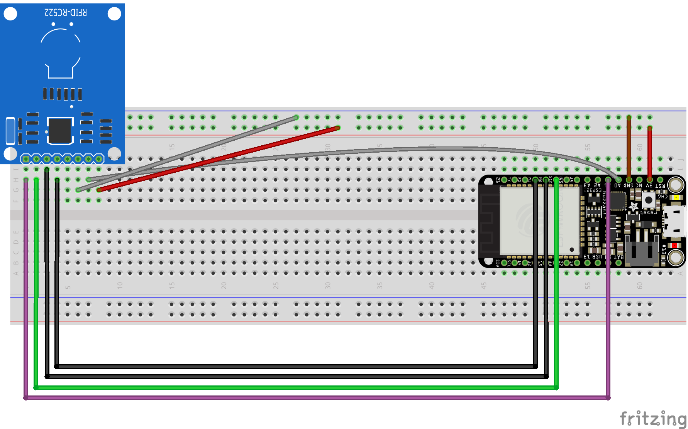

# Schéma avec RFID cablé sur ESP32

(schéma avec zoom sans perte disponible sur le fichier [RFID_bb.pdf](RFID_bb.pdf)).

## Schéma réalisé sur Fritzing

[RFID.fzz](RFID.fzz)

## Les "parts" utilisées se trouvent dans le dossier [fzz_parts](fzz_parts).
